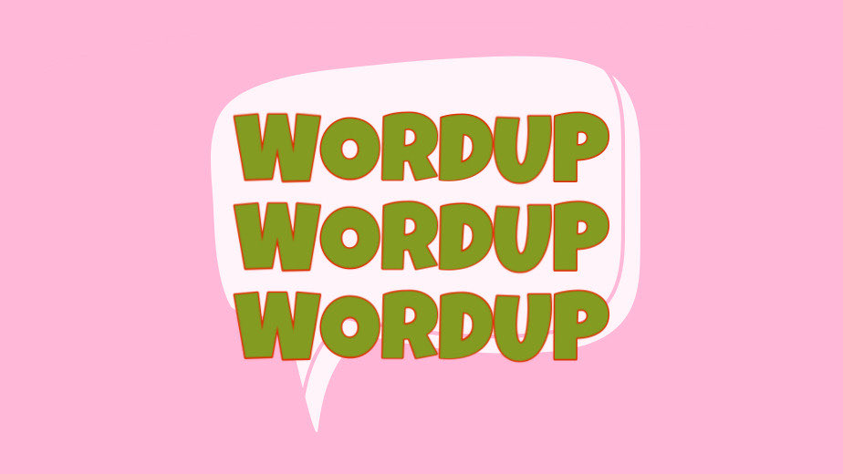

# WordUp

Group Project for CSPB3308

## Team Members

Claudia Hidrogo, Raul Ramos, Christie Hui

## Vision Statement

WordUp aims to provide a useful tool for users to be able to study vocabulary words in preparation for certain exams (e.g. the GRE) or for general vocabulary improvement.

## Motivation

The motivation behind this project is to aid users with tracking their vocabulary study progress in an efficient manner.

## Risks to project completion (tentative)

Risks to project completion include but are not limited to:
- new working environment 
- little prior experience with working with respective team members

## Mitigation Strategy for above risks

- weekly progress check-ins

## Development method

Agile, primarily using Jira for story/feature tracking